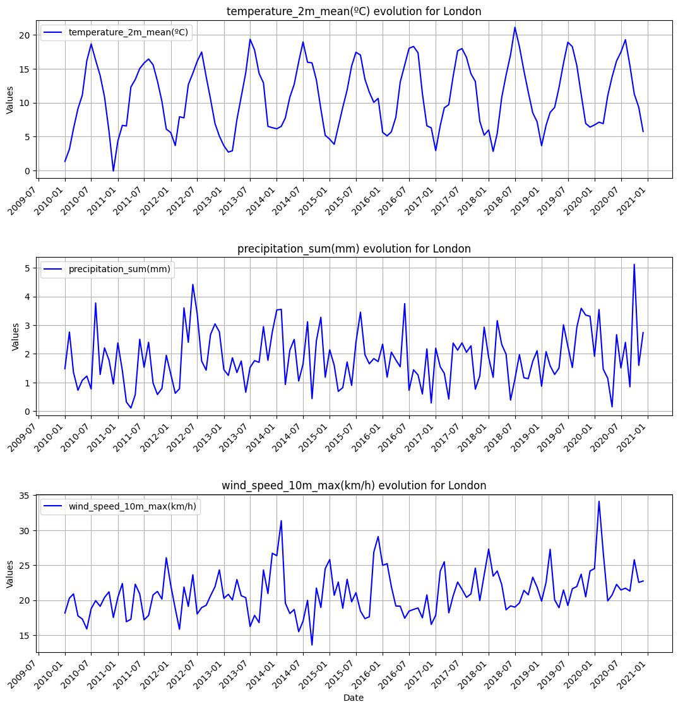
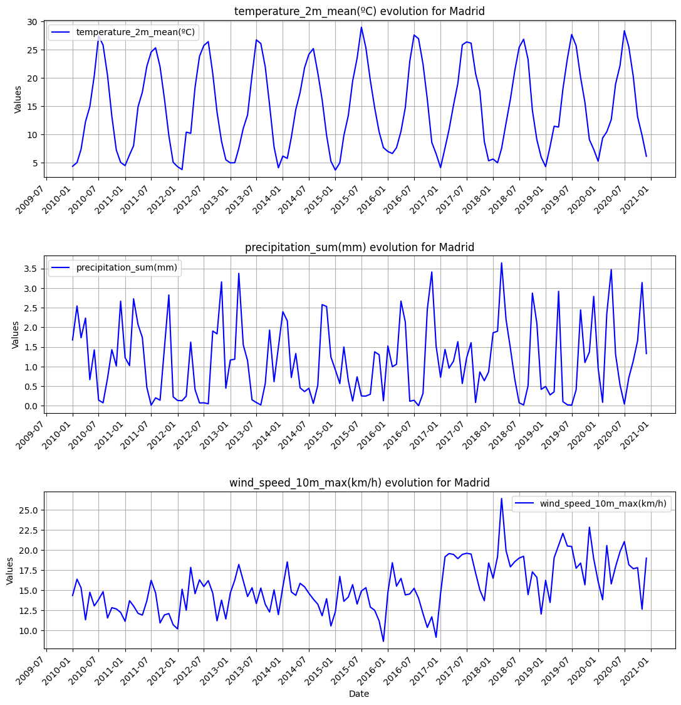
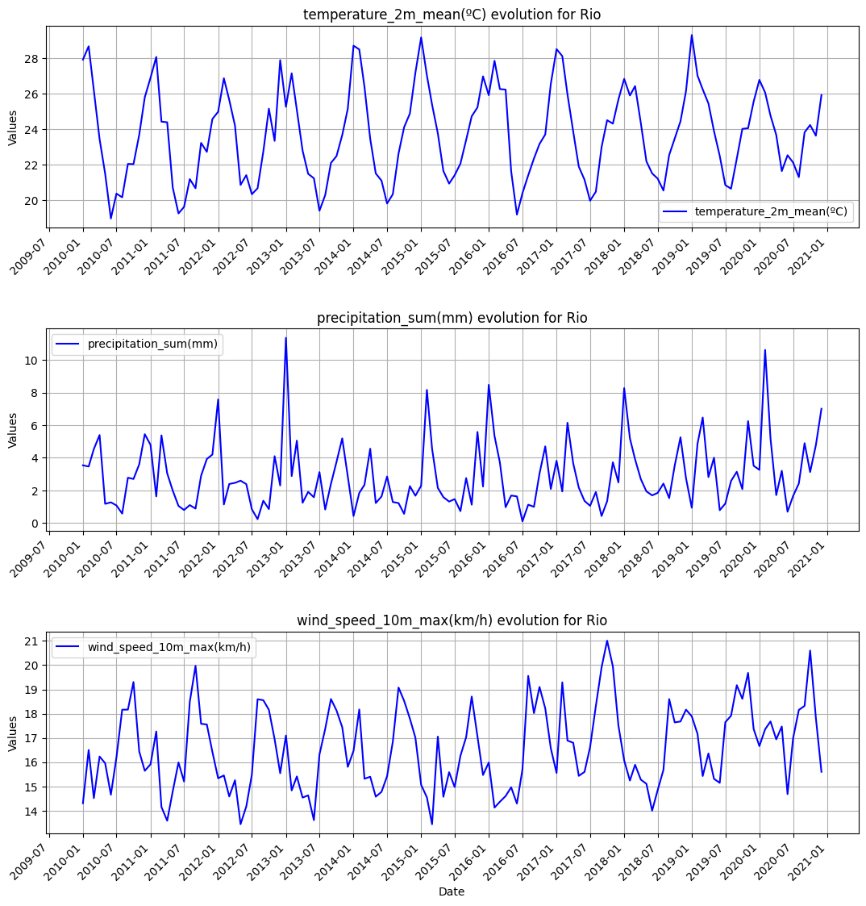

# Weather API

A simple API project for retrieving weather data.

# 1. Execute project

1. Clone the repo

2. Start the virtual environment `uv sync` and `source .venv/bin/activate` will create the environment with the dependencies defined at pyproject.toml.
3. We can add new dependencies with `uv add <package>`

4. Execute `python src/meteo-api.py`

5. Results will be available in results/ folder (created automatically after step 4 execution)

# 2. Results

#### 2.1 London

#### 2.2 Madrid

#### 2.3 Rio
